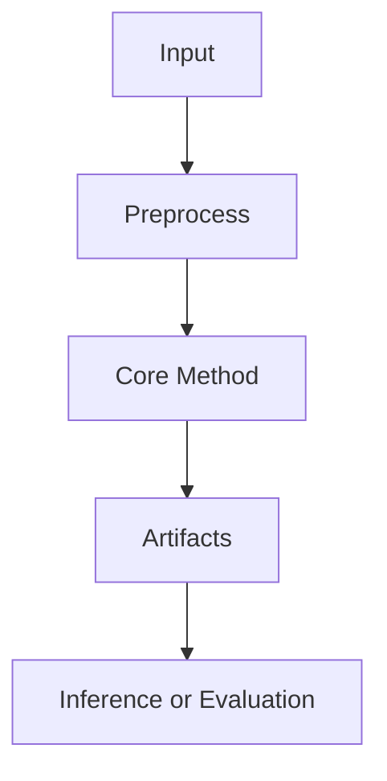

# Wiki Template

Use this as the default structure. Remove irrelevant sections; add project-specific sections when needed.

## 1. Executive Summary

- One-paragraph project purpose.
- Main technical idea.
- What is implemented vs only implied.

## 2. System Map

Include a diagram:



Then include a module table:

| Area | Files | Responsibility | Inputs | Outputs |
|---|---|---|---|---|

## 3. Task / Method / Dataset / Metric / Result

| Section | Findings | Evidence |
|---|---|---|
| Task | | |
| Method | | |
| Dataset | | |
| Metric | | |
| Result | | |

## 4. Data And Artifact Scale

| Artifact | Type | Count / Size | Role |
|---|---:|---:|---|

Mention sampling method if counts are approximate.

## 5. Method Walkthrough

Explain the method in stages. For each stage:

### Stage N: Name

- Purpose:
- Input:
- Process:
- Output:
- Key files:

Include pseudocode or a core code excerpt when it clarifies the method:

```python
# Pseudocode or small representative code block
```

## 6. Core Algorithm

Use this section for CS/research repos. Prefer pseudocode when exact code is long:

```text
Algorithm: Name
Input: ...
Output: ...
1. ...
2. ...
3. ...
```

Then map pseudocode steps back to source files.

## 7. External Context

Use only when web research was requested or useful.

| Related Work / Source | What It Does | Relation To This Repo |
|---|---|---|

Separate:

- Papers and official repos.
- Official docs / benchmark pages.
- Issues, discussions, forums, blog posts.

## 8. Innovation Points

List concrete innovations relative to:

- Naive baseline.
- Common approach in literature.
- Related repos.

Each point should include evidence from local code or cited sources.

## 9. Limitations And Risks

- Missing evaluation or metrics.
- Hardcoded paths or environment assumptions.
- Dead/commented code.
- Scalability bottlenecks.
- Reproducibility gaps.

## 10. How To Reproduce Or Extend

Include runnable commands only if verified or clearly marked as inferred.

```bash
# command
```
